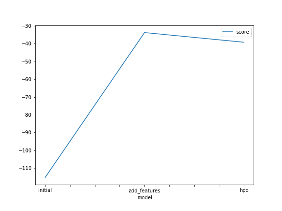
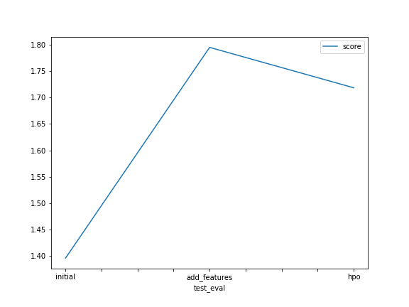

# Report: Predict Bike Sharing Demand with AutoGluon Solution
#### Pedro Ivo Tostes

## Initial Training
### What did you realize when you tried to submit your predictions? What changes were needed to the output of the predictor to submit your results?
I had to create a new submission dataframe with datetime column where I got sample submission file and a count column that I got from predictions variable.
The change I did was set all values lower than 0 equals to 0.

### What was the top ranked model that performed?
WeightedEnsemble_L3 model with a score of -115.178967

## Exploratory data analysis and feature creation
### What did the exploratory analysis find and how did you add additional features?
#### 1 - During the exploratory analysis I found some variables which the data types weren't the best choice for them. By viewing the histogram graphs, these variables were presented as discrete distribution so they were transformed in categorical variables.
Variables: 'season', 'holiday', 'workingday' and 'weather'
#### 2 - I add more features through the variable 'datetime'. From it I was able to create 5 more categoricals var: 'year', 'month', 'day', 'hour' and 'day_of_week'.
As sugestion, from 'hour' and 'workingday' it was ablet to create a new feature called 'rush_hour' as describe below:
- not rush hour -> 0
- rush hour -> 1

- Time considered as rush hour:
    - morning - 7-9am
    - lunch - 11am-1pm
    - evening rush hour - 5-6pm

### How much better did your model preform after adding additional features and why do you think that is?
WeightedEnsemble_L2 model with score_val of -33.824789. The model performed 71% better than the first one (comparing model score values).
This improvement is mainly because during the training phase, the algorithm considered the news features as categorical values so it has more information about the problem.
In other hand the Kaggle Score got worse. It went from 1.4 to 1.8, getting 29% worse. This of situation is found when the model is overfitted for train dataset.

## Hyper parameter tuning
### How much better did your model preform after trying different hyper parameters?
The best model perfomance was WeightedEnsemble_L2 with a score value of -39.26. Compared with the previous model, it got 16% worse.
However, when it is compared using Kaggle score, this model peformed with a score of 1.72, which is 4% better than the previous one.

### If you were given more time with this dataset, where do you think you would spend more time?
Another important job would be do more hyperparameter tuning  sets in respect of normalization for trying to decrease the overfit.

### Create a table with the models you ran, the hyperparameters modified, and the kaggle score.

| model | hpo | hpo2 | hpo3| hpo4 | score |
| ------ | ------ | ------ | ------ | ------ | ------ |
| initial | default values | default values | default values | default values | 1.39539 |
| add_features | default values | default values | default values | default values | 1.79542 |
| hpo |nn_opt = 'num_epochs': 15, 'learning_rate': 1e-4, 'activation': 'relu', 'layer': 100, 'dropout_prob': 0.1' | gbm_opt = 'learning_rate': 0.01, 'num_boost_round': 200, 'num_leaves': 300, 'boosting': 'random_forest' | xgb_opt = 'eta': 0.01, 'gamma': 1.0, 'max_depth': 10, 'sampling_method': 'uniform', 'lambda': 1.1 | rf_opt = 'n_estimators': 1000, 'max_depth': 15, 'random_state': 0, 'min_samples_split' : 5, 'n_jobs': -1 | 1.71874 |

### Create a line plot showing the top model score for the three (or more) training runs during the project.

### Create a line plot showing the top kaggle score for the three (or more) prediction submissions during the project.

## Summary
---
In this project we build models to predict the bike demand sharing given the historical data. The first models were trained using the data without any manipulation or even EDA. So we have the first score values from trained models and Kaggle platform which were considered our initial benchmark.

At the next step was performed an EDA (Exploratory Data Analysis) which consists in analyze the data and create news features based on the existents.
Another task performed was change the variables data type to one that makes more sense according to its definition.
After that I trained another set of models using AutoGluon which give me a score value of -33.824789, that was better than the first one (-115.178967).
But the Kaggle Score was worse when we compared with the first one: 1.8 for the second model against 1.4 for first model.

With prepared features, I tuned some hyperparameters for training some models algorithm. I chose 4 type of models to set the hyperparameters which were:
-  Neural networks:
    - nn_opt = ‘num_epochs’: 15, ‘learning_rate’: 1e-4, ‘activation’: ‘relu’, ‘layer’: 100, ‘dropout_prob’: 0.1’
- GBM (tree-based model):
    - gbm_opt = ‘learning_rate’: 0.01, ‘num_boost_round’: 200, ‘num_leaves’: 300, ‘boosting’: ‘random_forest’
- XGBoost model:
    - xgb_opt = ‘eta’: 0.01, ‘gamma’: 1.0, ‘max_depth’: 10, ‘sampling_method’: ‘uniform’, ‘lambda’: 1.1
- Random Forest
    - rf_opt = ‘n_estimators’: 1000, ‘max_depth’: 15, ‘random_state’: 0, ‘min_samples_split’ : 5, ‘n_jobs’: -1

After training the models, I get a slight better performance compared with the previous one. 1.72 against 1.80.

At last I compared the Kaggle score of all trained model and plotted these scores against hyperparameter settings to analyze the relative improvement or degradation in performance.